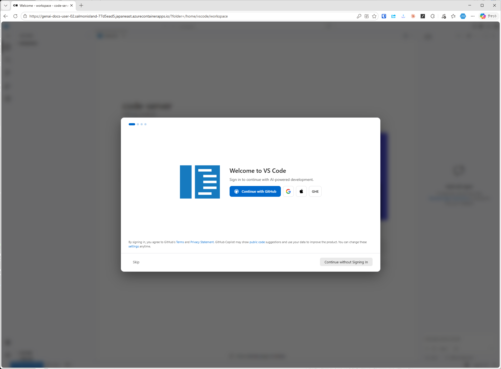
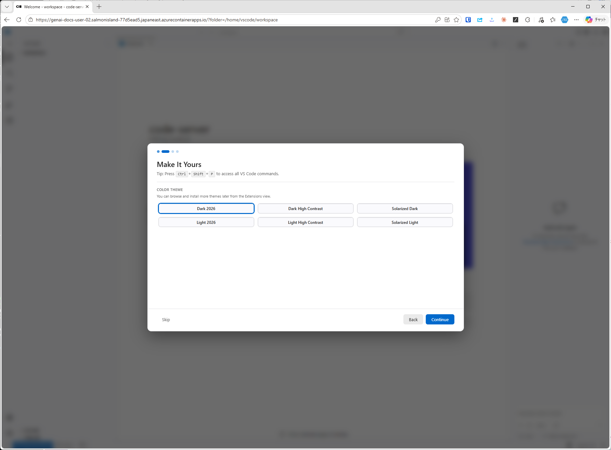
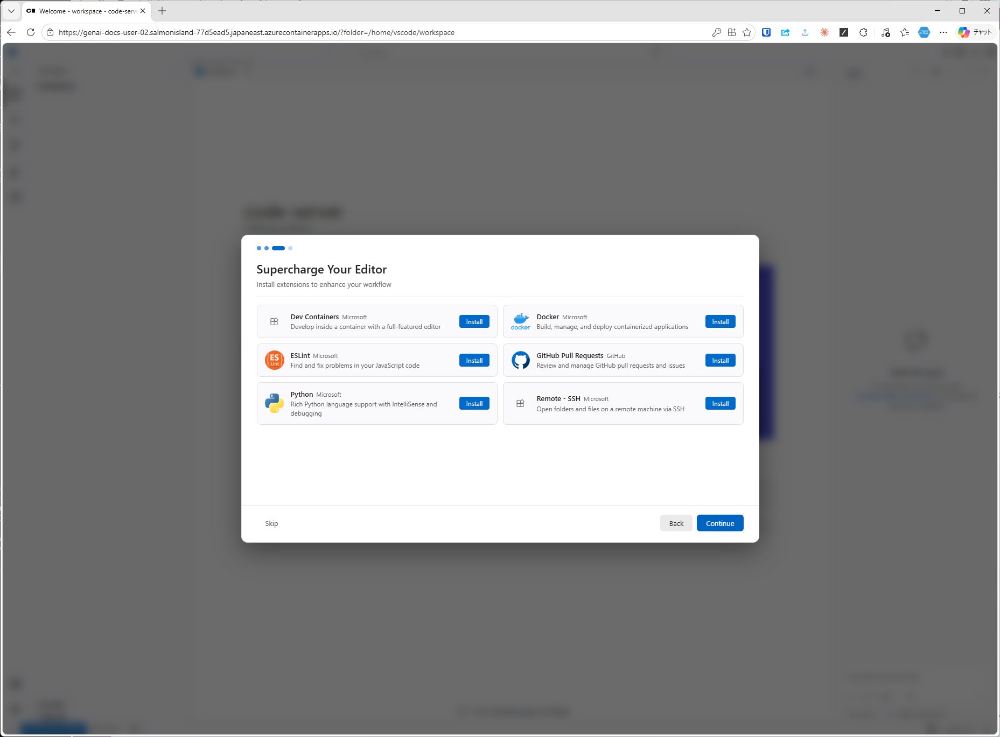
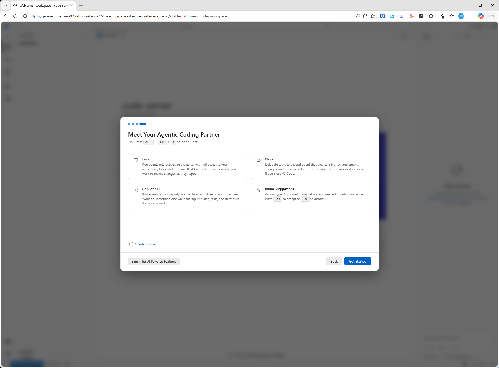
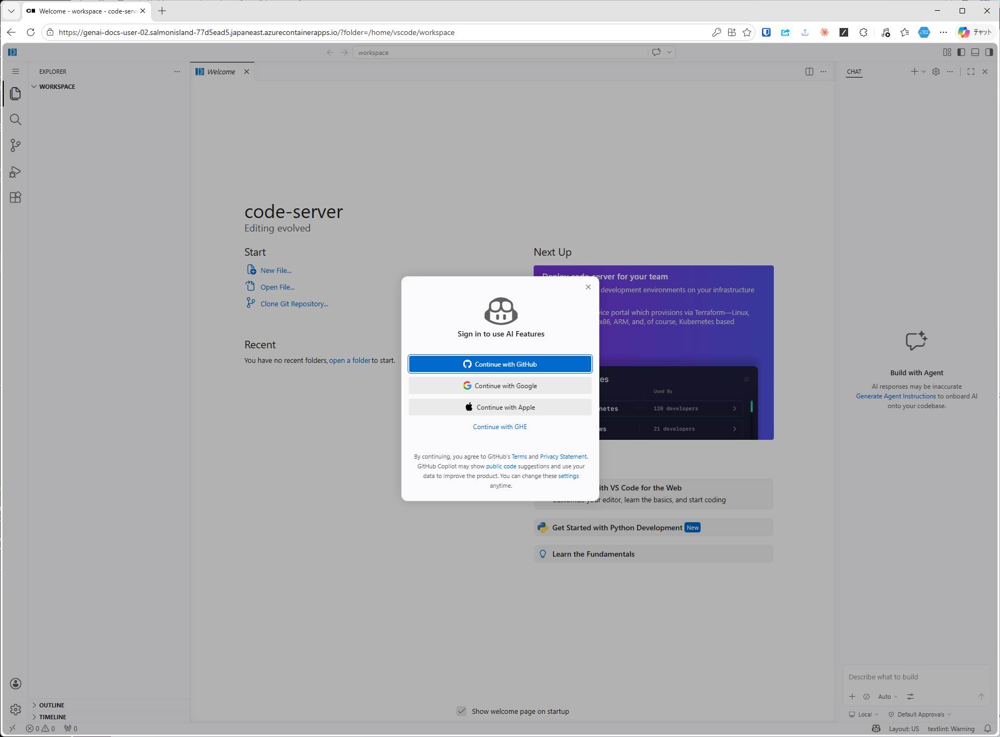
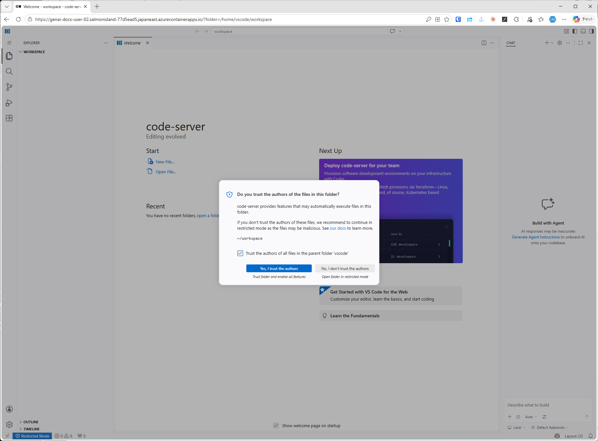

# VS Code (code-server) の初期化

ブラウザでcode-serverを開くと、初回にWelcomeウィザードが走る。以下の順にクリックしていく。

## 1. サインイン

`Continue without Signing In` で十分（AI機能は後から個別に設定する）。

## 2. カラーテーマ

好みのテーマ（既定の `Dark 2026` など）を選び `Continue`。

## 3. 拡張機能

必要なものだけ `Install`。未選択でも進めて構わない。

## 4. Agentic Coding の紹介

内容を確認して `Get Started`。

## 5. AI Features サインイン（スキップ可）

VS Code組込みのAIサインインは後続の各CLIエージェントで個別に設定するため、ここでは閉じて構わない。

## 6. フォルダーを信頼する

ワークスペースを開いた直後に信頼確認ダイアログが出る。`Yes, I trust the authors` を選ぶ。

次は [GitHub リポジトリの準備](02.github.md) に進み、ForkしたリポジトリをVS Code上でクローンする。
