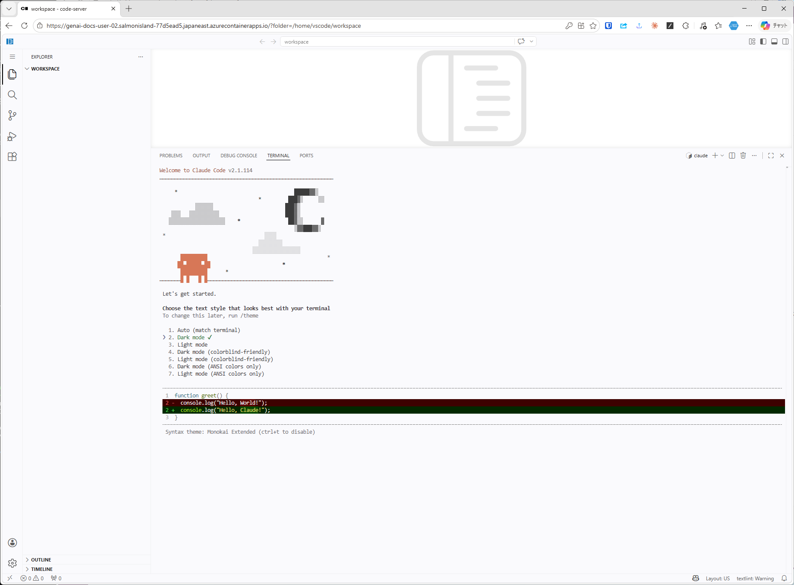
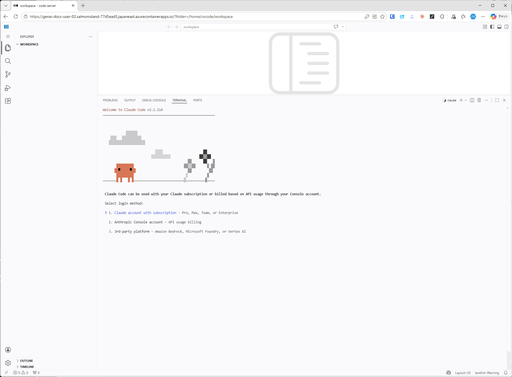
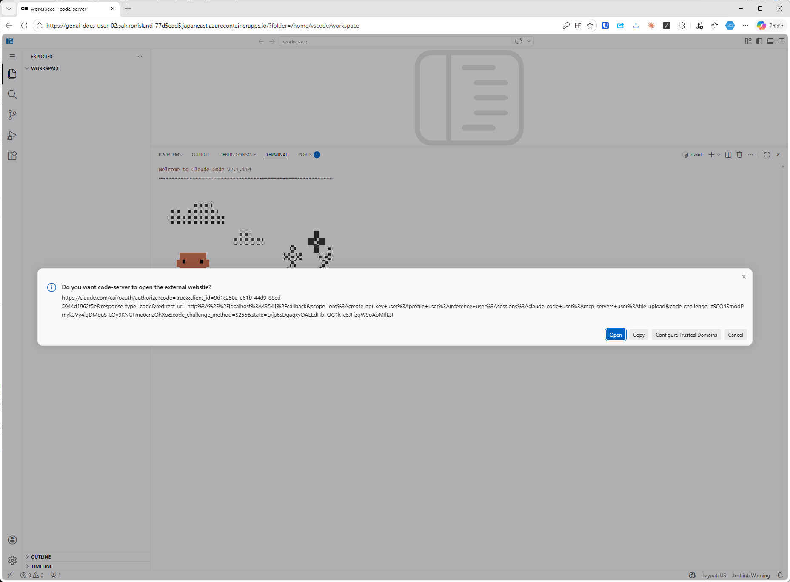
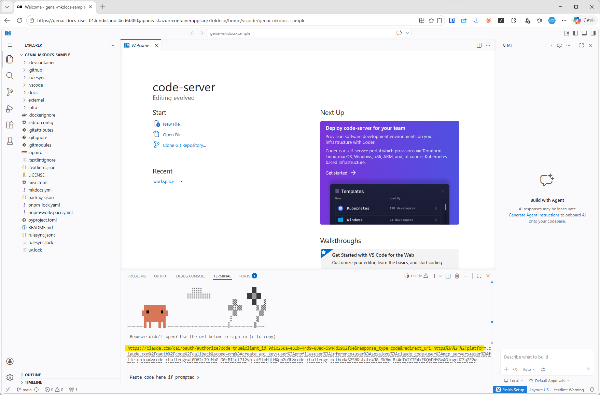
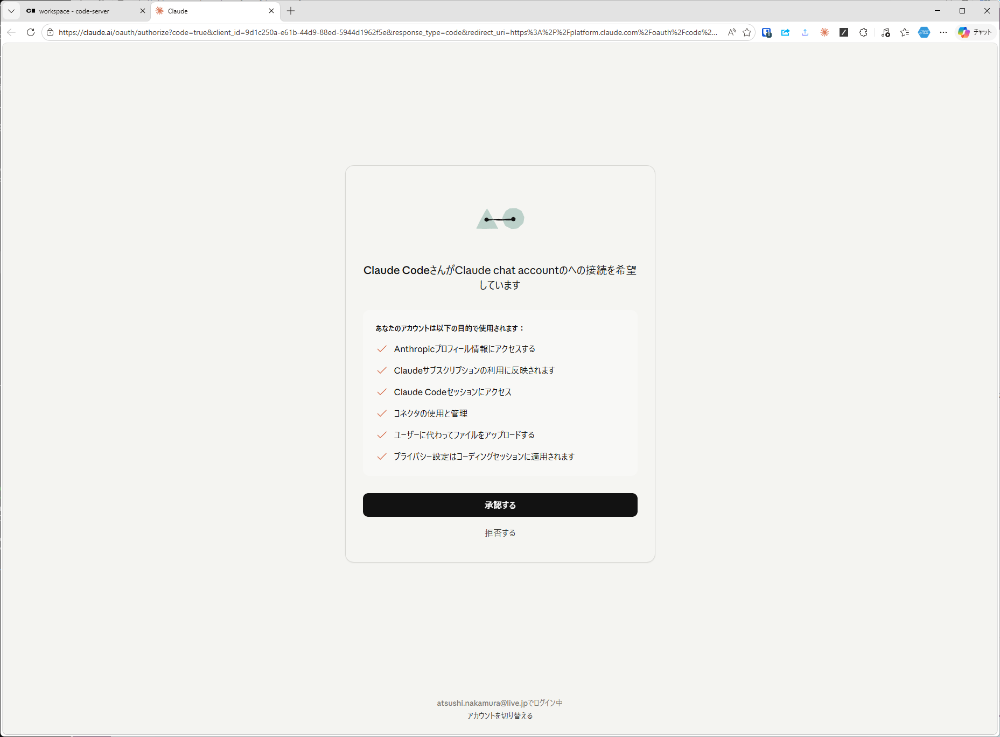
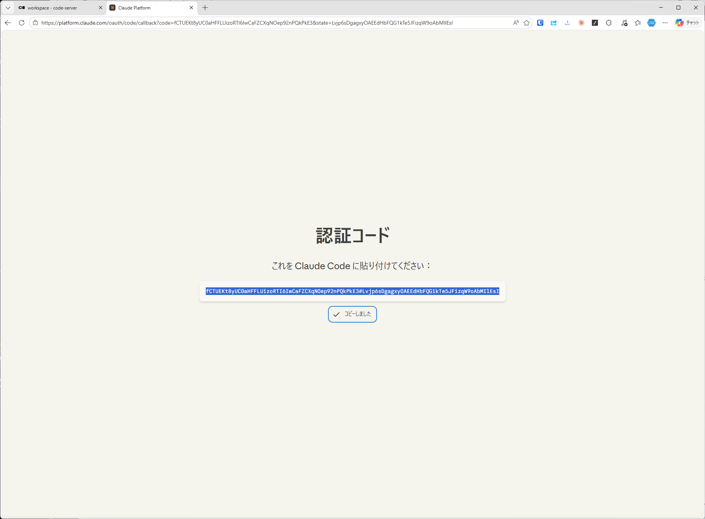
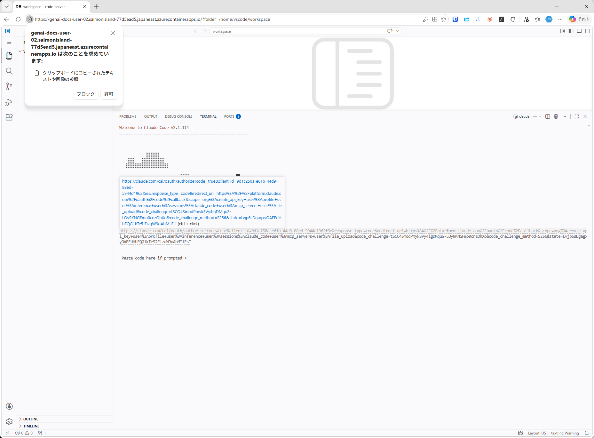

# Claude Code のサインイン

ターミナルで `claude` を起動し、ブラウザ経由で認証コードを取り込む。

## 1. テーマを選択する

任意のテーマを選択する。

## 2. 認証方式を選択する

任意の認証方式を選択する。ここではサブスクリプション認証を選択する。

## 3. 「外部サイトを開く」ダイアログは閉じる

`claude.com` への遷移を促すダイアログが表示されるが、ここから `Open` を押すとリダイレクト先（ローカルホスト）の都合で正常に認証が完了しない。

**このダイアログは閉じる**。

## 4. コンソール上の URL を `Ctrl + Click` で開く

コンソールにURLが表示される。そのURLを `Ctrl + Click` で開き、ブラウザでClaudeにログインする。

## 5. OAuth を承認する

ブラウザで`承認する`をクリック。

## 6. 認証コードをコピーする

承認後に表示される認証コードを`コードをコピー`ボタンでクリックする。

## 7. コンソールにコードをペーストし、クリップボード参照を許可する

コンソールの `Paste code here if prompted >` に貼り付けると、ブラウザがクリップボード参照の許可を求めてくる。`許可` をクリックするとコードが貼り付けられる。

Enterを押して、サインインを完了する。

