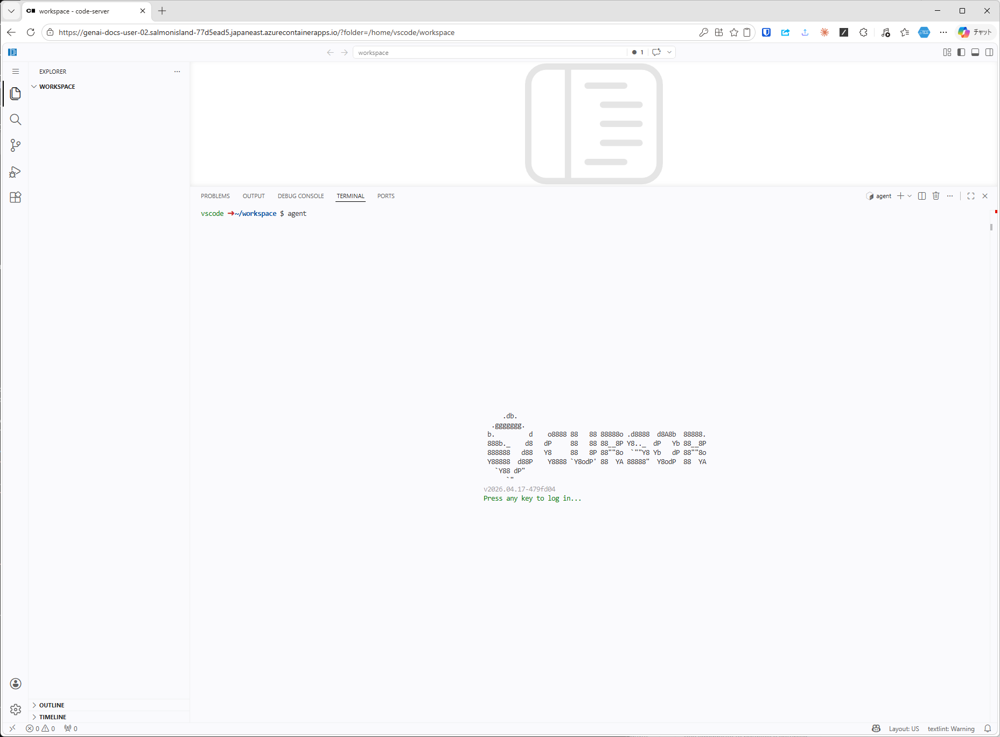
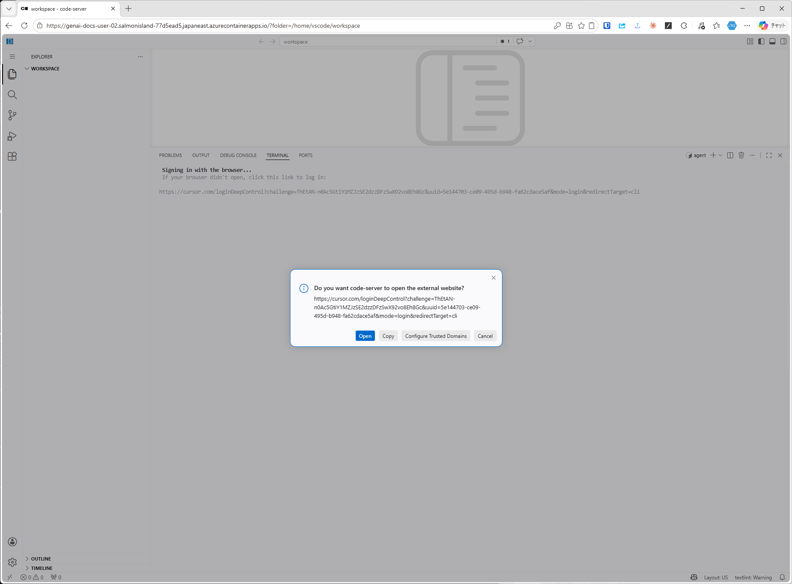

# Cursor CLI のサインイン

VS Codeのターミナルで `agent` コマンドを実行し、ブラウザ経由でサインインする。

## 1. ターミナルを開いて `agent` を実行する

`Ctrl + @` でターミナルを開き、`agent` コマンドを実行する。起動ロゴと `Press any key to log in...` が表示される。

## 2. 任意のキーを押してブラウザ認証を承認する

任意のキーを押すと、`cursor.com` への遷移を促すダイアログが表示される。`Open` をクリックしてブラウザを開き、表示されたCursorのサインインを承認すると完了する。

