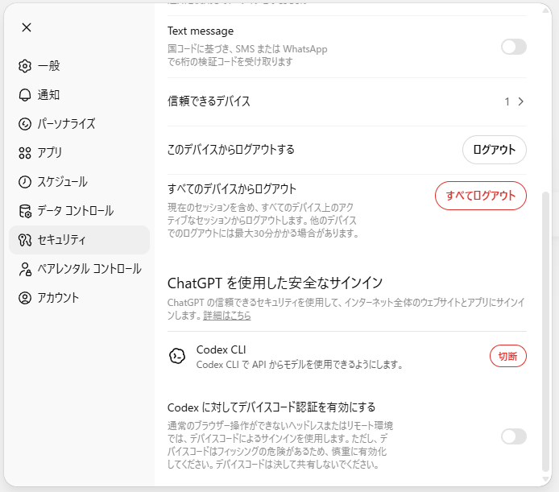
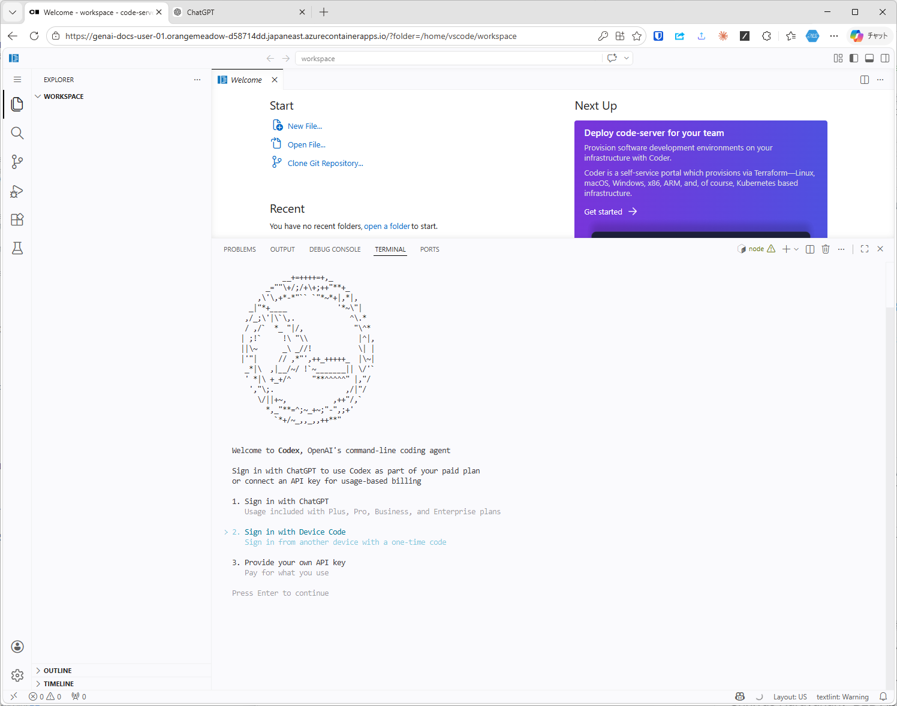

# Codex CLI のサインイン

!!! warning "デバイスコード認証を使う理由"
    Codex CLIは本環境ではURL認証が正常に起動しないため、**デバイスコード認証** を使う。
    ただしOpenAIではフィッシング対策のため、デバイスコード認証は既定で **OFF** にされている。
    本手順のために **一時的に ON** にし、認証が完了したら **必ず OFF に戻す**。

## 1. ChatGPT 側でデバイスコード認証を有効化する

ChatGPTの `設定 → セキュリティ → ChatGPT を使用した安全なサインイン` で、`Codex に対してデバイスコード認証を有効にする` を **ON** にする。

## 2. Codex CLI を起動してサインイン方式を選ぶ

ターミナルで `codex` を起動し、`2. Sign in with Device Code` を選ぶ。

表示されるデバイスコードをChatGPT側の案内ページに入力してサインインを完了する。

## 3. デバイスコード認証を OFF に戻す

サインインが完了したら、手順1と同じ画面で `Codex に対してデバイスコード認証を有効にする` を **必ず OFF** に戻す。ONのまま放置するとフィッシング被害のリスクが高まるため、この作業を忘れないこと。
