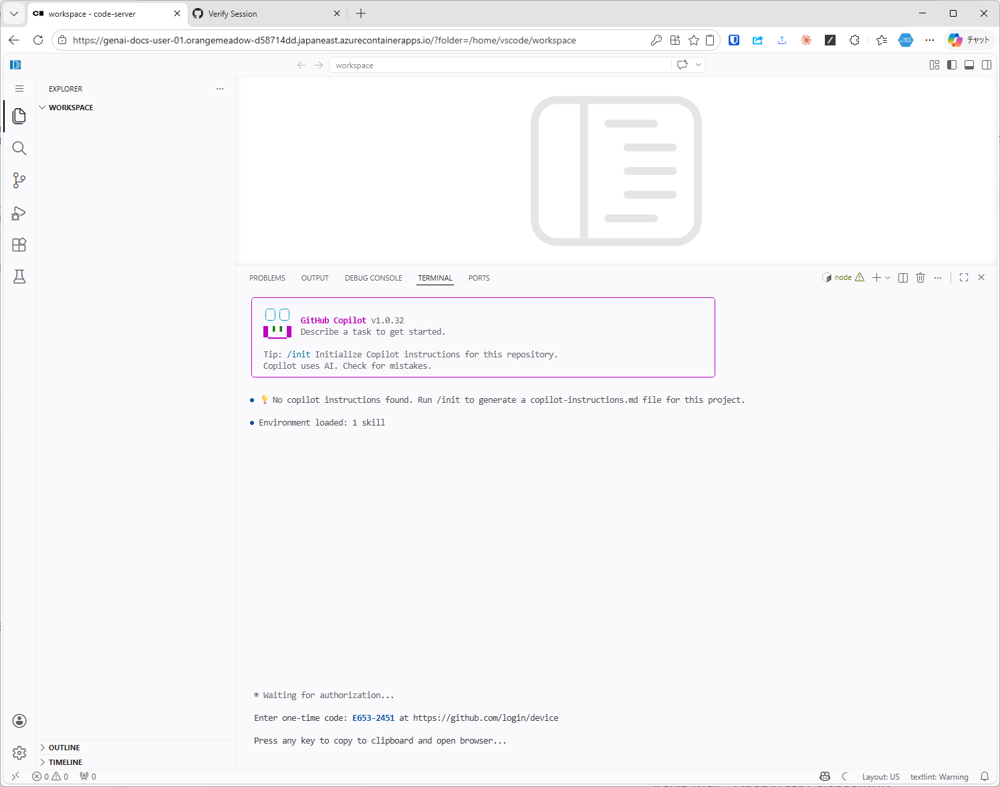

# GitHub Copilot CLI のサインイン

ターミナルで `copilot` を起動し、ワンタイムコード方式でGitHubアカウントに接続する。

## 1. Copilot CLI を起動

起動すると `Waiting for authorization...` とともに **one-time code**（例： `E653-2451`）と `https://github.com/login/device` のURLが表示される。

## 2. ブラウザで one-time code を入力

`https://github.com/login/device` を開き、ターミナルに表示されたone-time codeを入力して承認する。ターミナルがサインイン完了状態に切り替わる。
